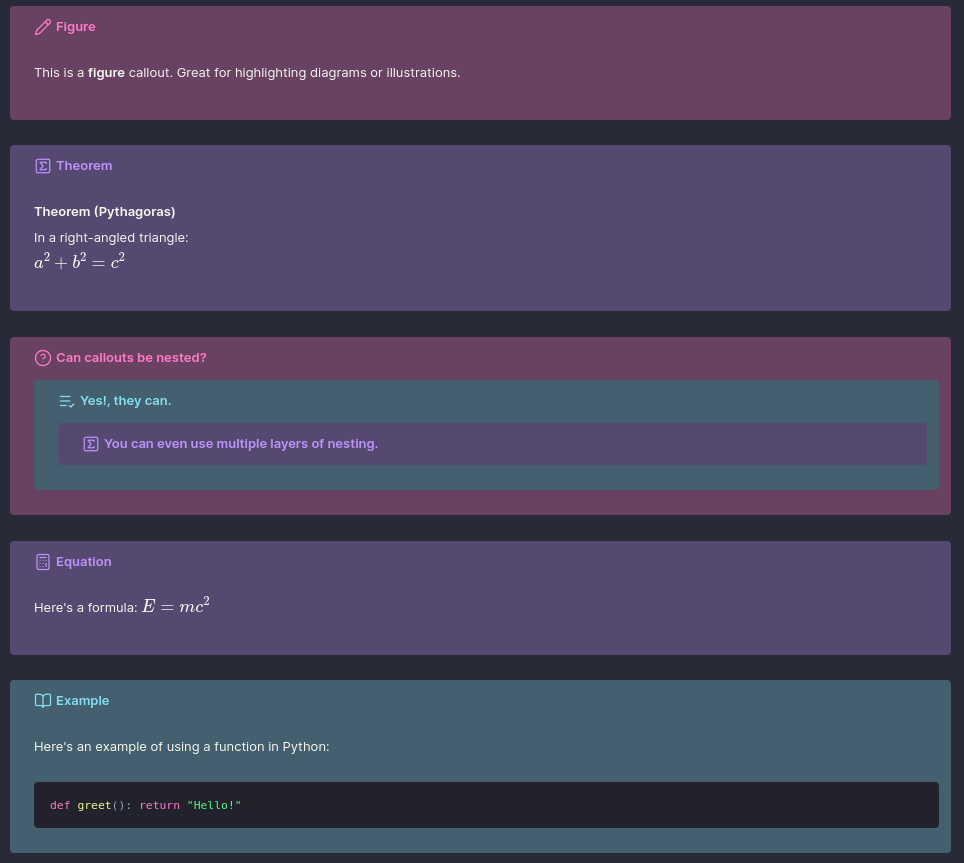

# Obsidian Custom Callouts

This repository contains a growing collection of custom callouts for use in Obsidian. These are defined using CSS snippets and are intended to improve visual clarity and structure when writing in Markdown.



## About

Obsidian supports callouts using syntax like `> [!note]`. While useful, the default styles are limited. This repository offers custom alternatives tailored for a cleaner, more expressive note-taking experience.

The styles follow a consistent colour scheme, use Lucide icons, and rely on core Obsidian features only, no plugins are required. Where possible, theme variables are used so that colours and layout integrate cleanly with existing themes.

My blog post on [Making Callouts in Obsidian](https://briannalaird.com/content/blog-posts/2025-06-17-making-callouts-obsidian.html) provides additional context and examples of how these callouts can enhance your notes.

## Theming

The callouts are themed to match the **Dracula** colour palette, which I use across my entire operating system. However, the structure is designed to be easily customisable.

At the top of the CSS, you’ll find the core palette defined using variables:

```css
:root {
    /* Dracula base palette */
    --drac-bg: #282A37;
    --drac-pink-rgb: 255, 121, 198;
    --drac-cyan-rgb: 132, 222, 240;
    --drac-purple-rgb: 189, 147, 249;
    --drac-green-rgb: 80, 250, 123;
    --drac-yellow-rgb: 241, 250, 140;
    --drac-red-rgb: 255, 85, 85;
}
```

You can modify these values to suit your preferred aesthetic without needing to alter the rest of the snippet.

The following block controls the overall appearance of each callout, ensuring the styling works cleanly across light and dark modes and maintains readability:

```css
/* Base background for all callouts */
.callout {
    background-color: var(--drac-bg) !important;
    position: relative;
    overflow: hidden;
}

/* Overlay using callout colour with opacity */
.callout::before {
    content: "";
    position: absolute;
    inset: 0;
    background-color: rgb(var(--callout-color), 0.3);
    pointer-events: none;
    z-index: 0;
    border-radius: var(--radius-s);
}

/* Ensure content stays above the overlay */
.callout > * {
    position: relative;
    z-index: 1;
}
```

This layered structure creates a subtle overlay effect based on the specific callout’s highlight colour while preserving text readability.

## Features

* Custom callout types (e.g. `figure`, `quote`, `info-block`)
* Nesting-compatible styling
* Designed to look good in both light and dark mode
* Easily themeable via a single set of CSS variables
* Does not override the default callouts unless you want it to

## Usage

1. Open Obsidian settings and navigate to **Appearance**
2. Scroll to **CSS snippets**
3. Click **Open snippets folder**
4. Create a file (e.g. `custom-callouts.css`)
5. Paste the callout CSS into the file
6. Return to Obsidian and enable the snippet from the list

Once enabled, you can use callouts like:

```
> [!figure] Figure 1
> This is a stylised figure box.
```

Or a collapsible version:

```
> [!figure]- Figure 1
> This version can be expanded or collapsed.
```

## Notes

* All styles are built using the standard Obsidian callout system
* CSS variables ensure colours work across themes and can be easily swapped
* Dracula-themed by default, but adaptable to any style
* Tested with both light and dark modes

## Contributions

Contributions are welcome. Feel free to open an issue or submit a pull request with improvements, fixes, or new callout styles.
